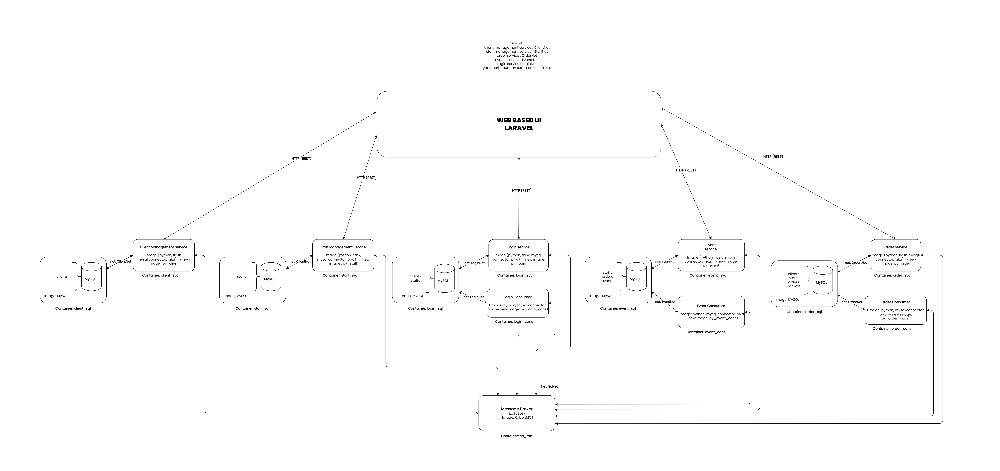

# Event Organizer Microservices Project
Project UAS Service Oriented Architecture / Arsitektur Berorientasi Layanan

### Kelompok 8:
1. C14200007 - Xuchin Valezka
2. C14200078 - Anthony Reynaldi
3. C14200094 - Steven Christando

## List Service
- Client Management Service - :5500/client
- Staff Management Service - :5501/staff
- Login Service - :5502/login
- Event Service - :5503/event
- Order Service - :5504/order

## Diagram

## UI
### User Login
#### As Client
Masuk sebagai client dengan input username dan juga password.

#### As Staff
Masuk sebagai staff dengan input username dan juga password.

#### Register as Client
Tampilan ketika akan mendaftar sebagai client baru. Diminta untuk memasukkan data baru seperti nama, nomor telepon, username, dan password.

### Client Side
Tampilan dari sisi client.
#### Edit Profile
Client dapat mengubah data dirinya dengan menu edit profile.

#### Homepage
Tampilan awal setelah client login, akan ditampilkan list order dari client apabila client sudah melakukan order.

#### Client Make Order
Tampilan ketika client akan membuat pesanan. Client dapat memasukkan tanggal acara, memberi catatan, dan juga memilih paket acara yang diinginkan.

#### Order Details
Tampilan ketika ingin melihat detil dari salah satu order. Akan ada detil acaranya beserta dengan detil rangkaian acaranya.

### Staff Side
Tampilan dari sisi staff.
#### Edit Profile
Staff dapat mengubah data dirinya dengan menu edit profile.

#### Homepage
Tampilan awal setelah staff login, akan ditampilkan list order dari client.

#### Order Details
Tampilan ketika ingin melihat detil dari salah satu order. Akan ada detil acaranya beserta dengan detil rangkaian acaranya.

##### Add Event
Setelah membuka detil order, staff yang bertanggung jawab (PIC) dapat menambahkan event (rangkaian acara) untuk acara tersebut.

#### Add New Staff
Staff dapat menambahkan data untuk staff baru.
